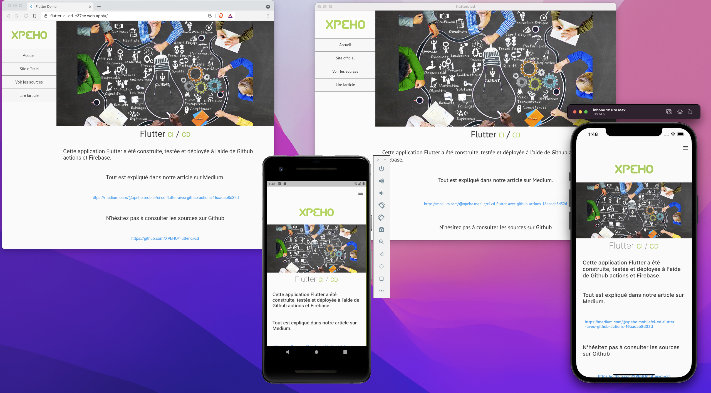

# fluttercicd

Flutter project used by XPEHO for Medium story.

## Medium

This project is open source and destinated to everyone who wants to learn about Github actions CI / CD for Flutter app building.

Read our story here: [https://medium.com/@xpeho.mobile/ci-cd-flutter-avec-github-actions-16aadab8d32d](https://medium.com/@xpeho.mobile/ci-cd-flutter-avec-github-actions-16aadab8d32d)

## Flutter

We choosed Flutter to illustrate this use case to show how easy is to make a single code and building it in a CI/CD automatically.

More informations about Flutter on [flutter.dev](https://www.flutter.dev/)

## Github actions

We choosed Github actions to build our Flutter app on several platforms.

More informations about Github actions on [https://github.com/features/actions](https://github.com/features/actions)

## Firebase

We choosed Firebase Web hosting for Web deployment use case.

More informations about Firebase on [firebase.com](https://www.firebase.com)

## About us

Please visit our website [xpeho.fr](https://www.xpeho.fr/)
